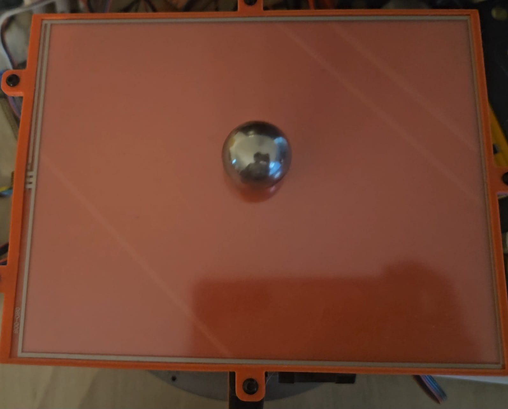
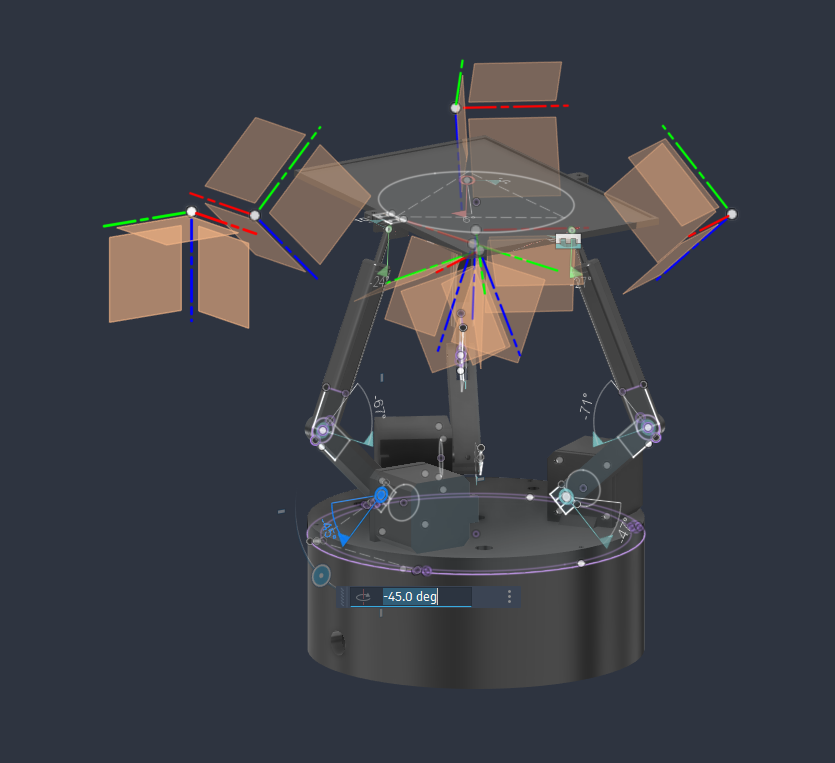

# Ball-Balancing Platform Firmware

Firmware for an STM32H5 that balances a ball on a tiltable
platform, it is written entirely in C using the native STM32 Ecosystem. A resistive touchscreen is used to sensethe ball's position, a PID
loop turns the position error into a desired platform tilt, an RRS3
parallel-manipulator inverse-kinematics model converts that tilt into three
motor angles, and three stepper motors drive the platform.

## How it works

The main loop in [Core/Src/main.c](Core/Src/main.c) ties everything together:

1. **Sense** — I reads the ball's (x, y) position off
   the resistive touchscreen. Each axis is read by driving one pair of GPIOs
   and sampling the opposing pair through `ADC1`, swapping roles between the
   X and Y axes. Touch calibration is persisted to flash.
2. **Control** — I run the PID controller per axis, in order to get the new desired position.
3. **Inverse kinematics** — [inverse_kinematics.c](User/Src/inverse_kinematics.c)
   solves the RRS3 (Revolute-Revolute-Spherical, 3-leg) parallel manipulator
   geometry, turning a desired platform height + tilt into each
   leg's motor angle.
4. **Actuate** — [stepper.c](User/Src/stepper.c) drives each leg's stepper
   motor via step/direction GPIOs.

Peripheral init (clocks, GPIO, ADC1, TIM1, I2C1) is generated by STM32CubeMX
from [h52.ioc](h52.ioc) into `Core/` and `cmake/stm32cubemx/`. All
application logic lives in `User/Src` / `User/Inc`, wired
together from the `USER CODE` sections of `Core/Src/main.c`.

## Repository layout

```
Core/                  CubeMX-generated HAL init + main.c (USER CODE sections only are hand-edited)
Drivers/               STM32H5 HAL + CMSIS (vendored)
User/Src, User/Inc/    Application logic: screen, pid, inverse_kinematics, stepper, utils
cmake/                 Toolchain file + generated stm32cubemx CMake target
tests/                 Host-side unit tests for inverse_kinematics.c
h52.ioc                CubeMX project file
```

## Parts List

- STM32H503CBT6 microcontroller
- 3x NEMA 16 stepper motors
- 3x TMC2208 stepper drivers
- 8V-100V to 3.3V voltage regulator
- 15V power supply
- 3x 100uF capacitors
- 3x 26mm tie rods
- M3 screws (6x 22mm, 12x 12mm, 5x 10mm)
- Proto PCBs and wires / custom PCB
- 3D printed parts

## Images

<p float="left">
  
  
</p>
